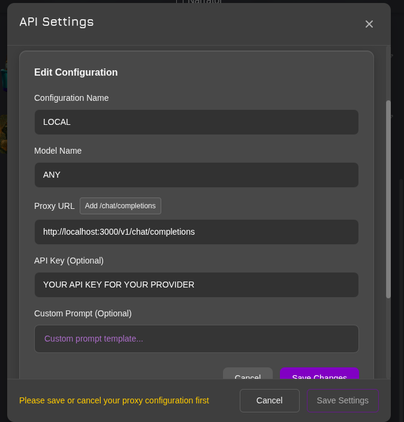

# Weball

A semi-stateless smart proxy for AI chatbots built with Bun.

## What's Currently Here

This is **Phase 0** - a basic passthrough proxy that forwards chat completion requests to LLM providers.

### Features

- **OpenAI-compatible API** - accepts `/chat/completions` requests
- **Provider forwarding** - proxies requests to configurable LLM providers (default: OpenRouter)
- **Model configuration** - all requests use the configured model
- **Streaming support** - handles both streaming (SSE) and non-streaming responses
- **CORS enabled** - allows cross-origin requests
- **Request logging** - logs all incoming requests with timestamps

### Architecture

Single-file TypeScript proxy server (`index.ts`) that:
- Accepts authorization headers (user's API key)
- Forwards requests to the configured provider
- Passes through responses without modification
- No sessions, no sandboxing, no persistence

### Running

```bash
# Install dependencies
bun install

# Copy environment template
cp .env.example .env

# Edit .env with your configuration
# Then start the server
bun start

# Or with watch mode
bun dev
```

### Configuration

Create a `.env` file (see `.env.example`):

```env
PORT=3000
PROVIDER_URL=https://openrouter.ai/api/v1
DEFAULT_MODEL=moonshotai/kimi-k2
```

Environment variables:
- `PORT` - Server port (default: 3000)
- `PROVIDER_URL` - LLM provider endpoint (required)
- `DEFAULT_MODEL` - Model to use for all requests (required)

### JanitorAI Setup

1. Start the Weeball proxy server: `bun start`
2. In JanitorAI, go to API Settings
3. Configure as follows:
   - **Proxy URL**: `http://localhost:3000/v1/chat/completions`
   - **API Key**: Your OpenRouter API key
   - **Model Name**: ANY (will be overridden by DEFAULT_MODEL)



The proxy will intercept requests and forward them to your configured provider with your chosen model.

### Tech Stack

- **Runtime**: Bun
- **Language**: TypeScript
- **Dependencies**: None (only dev dependencies for types)
